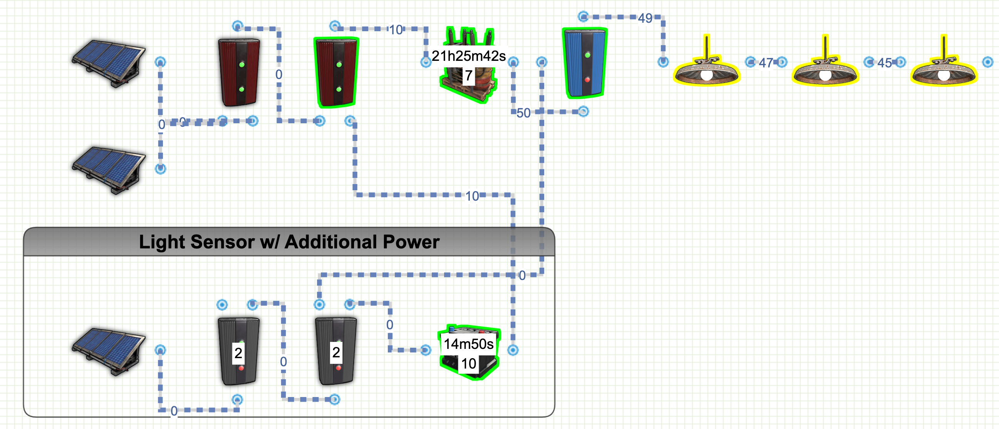

# Rust Electric Circuits
This is a collection of Rust Electrical diagrams that can be used in the game Rust in order to help more securely defend your base. 
My goal is to help others that are new to rust electricity or perhaps seasoned players looking for more advanced wiring diagrams. 
Feel free to send me a message if you see anything that could be improved on, have questions, or would like me to review something you are working on

## Popular Circuit Designs:
<b>2 Battery Backup Circuit with Minimal Power Draw</b> 
<i>(Approximately 8 Hours Of 100 rW Maximum Usage)</i> 

<b>Links:</b>
* [Rustician.io Circuit Link](https://www.rustrician.io/?circuit=b75b8f5cf1336f12edf6e280d006b47f)
* [Github Link To Battery Diagrams](batteries)
* [XML Export](batteries/xml/BackupBattery-2Batteries.xml)

## Advanced Automatic Lights Circuit

This advanced automatic lighting lets you control roughly how dark you want the lights to come on by setting a required minimum amount of draw (4 rW). 
<b>Links:</b>
* [Rustician.io Circuit Link](https://www.rustrician.io/?circuit=5cb2fdf4600dbf3edd42de5d13f5fa75)
* [Github Link To Lighting Diagrams](lights)
* [XML Export](lights/xml/AdvancedAutoLights.xml)