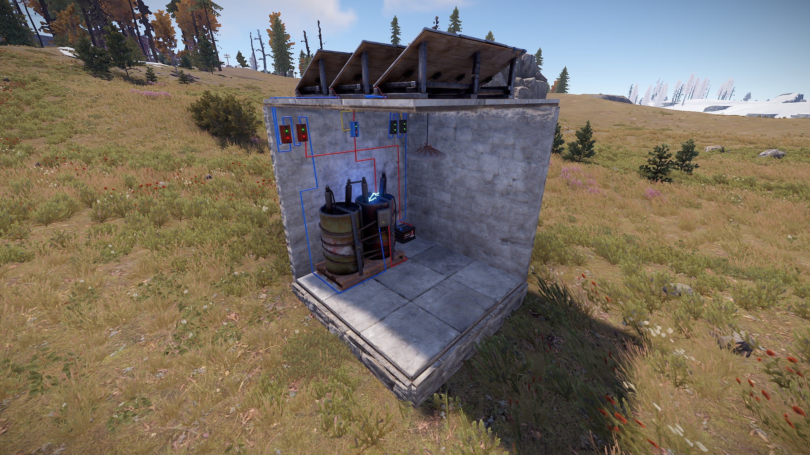
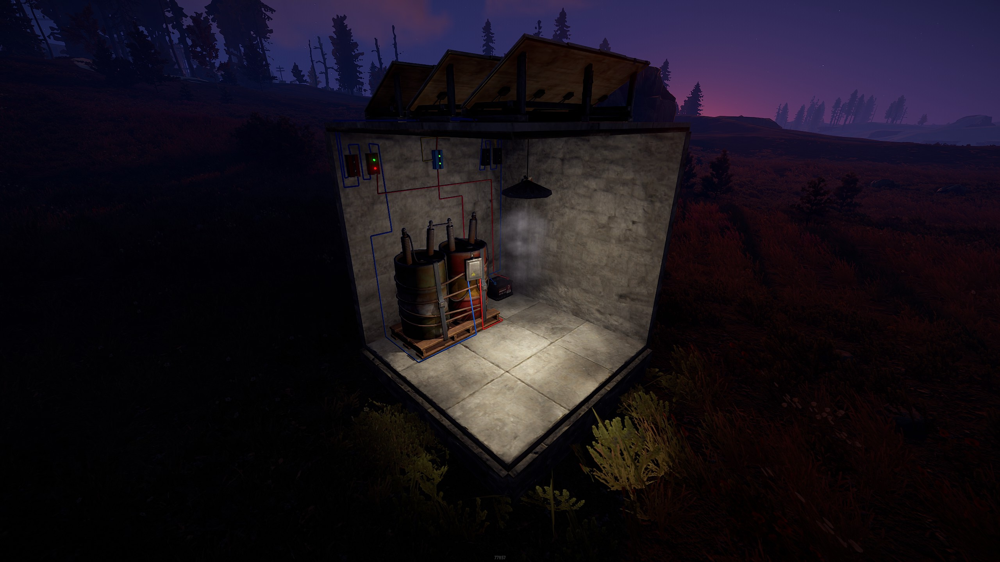

# Rust Electric Circuits
This is a collection of Rust Electrical diagrams that can be used in the game Rust in order to help more securely defend your base. 
My goal is to help others that are new to rust electricity or perhaps seasoned players looking for more advanced wiring diagrams. 
Feel free to send me a message if you see anything that could be improved on, have questions, or would like me to review something you are working on

## Diagram Links
* [Bases](bases/)
* [Batteries](batteries/)
* [Lights](lights/)
* [Tesla Coils](teslacoils/)
* [Timers](timers/)
* [Trap Bases](trapbases/)

## Popular Circuit Designs:
### Advanced Automatic Lights Circuit

This advanced automatic lighting lets you control roughly how dark you want the lights to come on by setting a required minimum amount of draw (4 rW). 
<b>Links:</b>
* [Rustician.io Circuit Link](https://www.rustrician.io/?circuit=5cb2fdf4600dbf3edd42de5d13f5fa75)
* [Github Link To Lighting Diagrams](lights)
* [XML Export](lights/xml/AdvancedAutoLights.xml)

### 2x2 Trap Base

This Circuit is designed for a 2x2 square base.  I've successfully tested this circuit on a vanilla PVP server and it works great. 
<b>Links:</b>
* [Rustician.io Circuit Link](https://www.rustrician.io/?circuit=c2a69ac375fe8c81ce79ea204078c269)
* [Github Link To Trap Base Diagrams](trapbases)
* [XML Export](trapbases/xml/2x2TrapBase.xmll)

### 2 Battery Backup Circuit with Minimal Power Draw
<i>(Approximately 8 Hours Of 100 rW Maximum Usage)</i> 

<b>Links:</b>
* [Rustician.io Circuit Link](https://www.rustrician.io/?circuit=b75b8f5cf1336f12edf6e280d006b47f)
* [Github Link To Battery Diagrams](batteries)
* [XML Export](batteries/xml/BackupBattery-2Batteries.xml)

### 4 Story Base Defense v1.0

This is a base layout for a solo base with a goal to have minimal power draw and no windmills as to not draw too much attention. 
The sensors are all wired to draw additional power from the battery including a secondary battery to supply the tesla coils each 33 rW.  
The system can sustain the full load of systems with some additional room to overprovision the rW. 
Additionally it includes a counter to let me know how many people walked by while I was out with a reset button when I get back on the server. 
Finally it includes automatic heating and lighting.  This is enough to scare most raiders though not enough for a full on rocket attack. 
<b>Links:</b>
* [Rustician.io Circuit Link](https://www.rustrician.io/?circuit=fd7c82fead5fe723aac485fc93aa125f)
* [Github Link To Base Design Diagrams](bases)
* [XML Export](bases/xml/4StoryBaseDefensev1.0.xml)

### Fireworks Display - Staggered Timers

The following Circuit uses the igniters on a staggering setup to ignite fireworks on 5, 20, and 45 seconds after hitting the button. 
This circuit could be used for anything you need to happen after a certain amount of time once you hit a button. 
The Max timer must be set longer than the igniter timers 
<b>Links:</b>
* [Rustician.io Circuit Link](https://www.rustrician.io/?circuit=44cda47c2666384e6310b578fd08d657)
* [Github Link To Timer Design Diagrams](timers)
* [XML Export](timers/xml/FireworksDisplay.xml)