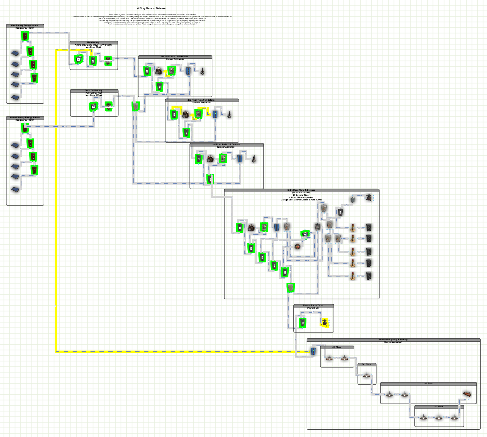

# Rust Base Defense Circuits
I've included some in-game base designs, for defending your base in the game of Rust, that I've either implemented or plan to implement in the future.  The goal with all of these designs are to provide maximum protection while minimizing the power draw and visible footprint to not stand out as a target for the large clan teams.

## 4 Story Base Defense v1.0

This is a base layout for a solo base with a goal to have minimal power draw and no windmills as to not draw too much attention. 
The sensors are all wired to draw additional power from the battery including a secondary battery to supply the tesla coils each 33 rW.  
The system can sustain the full load of systems with some additional room to overprovision the rW. 
Day Time Active Draw is 37rW, Night is 56rW. 
Max load on the Main Battery is 81 rW and max load if all floors are attacked at once is 100 rW for the tesla coil. 
The base is equipped with a front door alarm that sets off lights and sound on every floor as well as a garage door with a turret auto activates for 20 seconds. 
Additionally it includes a counter to let me know how many people walked by while I was out with a reset button when I get back on the server. 
Finally it includes automatic heating and lighting.  This is enough to scare most raiders though not enough for a full on rocket attack. 
<b>Links:</b>
* [Rustician.io Circuit Link](https://www.rustrician.io/?circuit=fd7c82fead5fe723aac485fc93aa125f)
* [XML Export](xml/4StoryBaseDefensev1.0.xml)