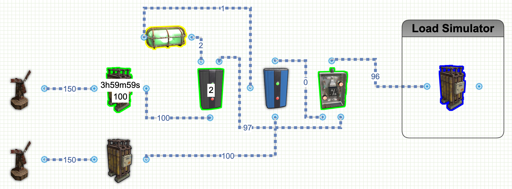
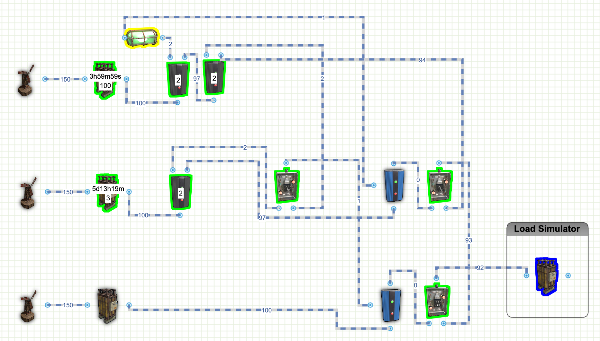

# Rust Battery Circuits
Included is a list of battery circuits that you can design and build on Rust.  I've included links to the circuit design on rustician.io as well as the xml exports of the circuits you can use here.

## 2 Battery Backup Circuit with Minimal Power Draw

(Approximately 8 Hours Of 100 rW Maximum Usage)  
This circuit was designed to allow for any battery to be lost and minimal single points of failure.   
Additionally each battery has just a few rW of battery drain to support the circuit.  
* Main Battery - Active Minimal Draw 4 rW, Maximum Output 96 rW
* 2nd Battery - Non-Running Draw 0 rW, Active Minimal Draw 2 RW, Maximum Output 98 rW
<i>Note: the Green Light is Optional, you can use any 1rW light or none here, but the draw will be the same</i> 
<b>Links:</b>
* [Rustician.io Circuit Link](https://www.rustrician.io/?circuit=b75b8f5cf1336f12edf6e280d006b47f)
* [XML Export](xml/BackupBattery-2Batteries.xml)

## 3 Battery Backup Circuit with Minimal Power Draw

(Approximately 112 Hours Of 100 rW Maximum Usage)  
This circuit was designed to allow for any battery to be lost and minimal single points of failure. 
Additionally each battery has just a few rW of battery drain to support the circuit. 
* Main Battery - Active Minimal Draw 8 rW, Maximum Output 92 rW
* 2nd Battery - Non-Running Draw 3 rW, Active Minimal Draw 6rW, Maximum Output 94 rW
* 3rd Battery - Non-Running Draw 0 rW, Active Minimal Draw 2 RW, Maximum Output 98 rW
<i>Note: the Green Light is Optional, you can use any 1rW light or none here, but the draw will be the same</i> 
<b>Links:</b>
* [Rustician.io Circuit Link](https://www.rustrician.io/?circuit=4f4212043cde403bb81ffbc8cb27fe5a)
* [XML Export](xml/BackupBattery-2Batteries.xml)