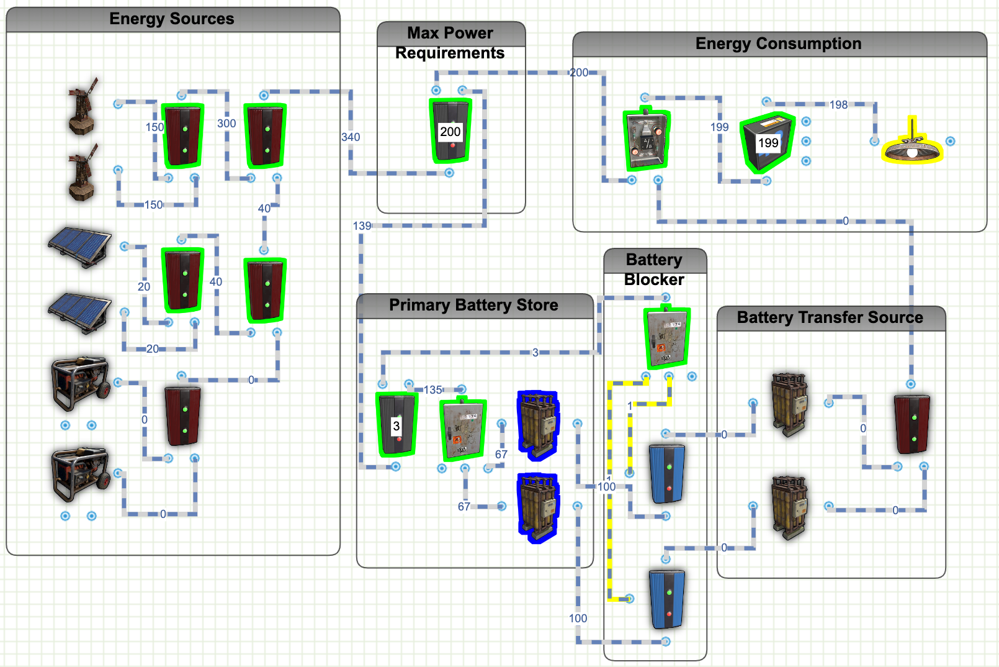

# Rust Battery Circuits
Included is a list of battery circuits that you can design and build on Rust.  I've included links to the circuit design on rustician.io as well as the xml exports of the circuits you can use here.

## 2 Battery Backup Circuit with Minimal Power Draw
<b>(Approximately 8 Hours Of 100 rW Maximum Usage)</b> 

This circuit was designed to allow for any battery to be lost and minimal single points of failure.   
Additionally each battery has just a few rW of battery drain to support the circuit.  
* Main Battery - Active Minimal Draw 4 rW, Maximum Output 96 rW
* 2nd Battery - Non-Running Draw 0 rW, Active Minimal Draw 2 RW, Maximum Output 98 rW 
<i>Note: the Green Light is Optional, you can use any 1rW light or none here, but the draw will be the same</i> 
<b>Links:</b>
* [Rustician.io Circuit Link](https://www.rustrician.io/?circuit=b75b8f5cf1336f12edf6e280d006b47f)
* [XML Export](xml/BackupBattery-2Batteries.xml)

## 3 Battery Backup Circuit with Minimal Power Draw
<b>(Approximately 12 Hours Of 100 rW Maximum Usage)</b> 

This circuit was designed to allow for any battery to be lost and minimal single points of failure. 
Additionally each battery has just a few rW of battery drain to support the circuit. 
* Main Battery - Active Minimal Draw 8 rW, Maximum Output 92 rW
* 2nd Battery - Non-Running Draw 3 rW, Active Minimal Draw 6rW, Maximum Output 94 rW
* 3rd Battery - Non-Running Draw 0 rW, Active Minimal Draw 2 RW, Maximum Output 98 rW 
<i>Note: the Green Light is Optional, you can use any 1rW light or none here, but the draw will be the same</i> 
<b>Links:</b>
* [Rustician.io Circuit Link](https://www.rustrician.io/?circuit=4f4212043cde403bb81ffbc8cb27fe5a)
* [XML Export](xml/BackupBattery-2Batteries.xml)

## 4 Battery Backup Circuit with Minimal Power Draw
<b>(Approximately 16 Hours Of 100 rW Maximum Usage)</b> 

This circuit was designed to allow for any battery to be lost and minimal single points of failure. 
Additionally each battery has just a few rW of battery drain to support the circuit. 
* Main Battery - Active Minimal Draw 12 rW, Maximum Output 88 rW
* 2nd Battery - Non-Running Draw 6 rW, Active Minimal Draw 11 rW, Maximum Output 89 rW
* 3rd Battery - Non-Running Draw 4 rW, Active Minimal Draw 7 rW, Maximum Output 93 rW
* 4th Battery - Non-Running Draw 0 rW, Active Minimal Draw 2 rW, Maximum Output 98 rW 
<i>Note: the Green Light is Optional, you can use any 1rW light or none here, but the draw will be the same</i> 
<b>Links:</b>
* [Rustician.io Circuit Link](https://www.rustrician.io/?circuit=eceffd66b52fb407edb4463487faaff4)
* [XML Export](xml/BackupBattery-2Batteries.xml)

## 5 Battery Backup Circuit with Minimal Power Draw
<b>(Approximately 20 Hours Of 100 rW Maximum Usage)</b> 

This circuit was designed to allow for any battery to be lost and minimal single points of failure. 
Additionally each battery has just a few rW of battery drain to support the circuit. 
* Main Battery - Active Minimal Draw 16rW, Maximum Output 84 rW
* 2nd Battery - Non-Running Draw 9 rW, Active Minimal Draw 16 rW, Maximum Output 84 rW
* 3rd Battery - Non-Running Draw 8 rW, Active Minimal Draw 13 rW, Maximum Output 87 rW
* 4th Battery - Non-Running Draw 5 rW, Active Minimal Draw 8 rW, Maximum Output 92 rW
* 5th Battery - Non-Running Draw 0 rW, Active Minimal Draw 2 rW, Maximum Output 98 rW 
<i>Note: the Green Light is Optional, you can use any 1rW light or none here, but the draw will be the same</i> 
<b>Links:</b>
* [Rustician.io Circuit Link](https://www.rustrician.io/?circuit=a7a5fc5777ec0ce01ec7eb3dda2b60af)
* [XML Export](xml/BackupBattery-5Batteries.xml)

## Advanced Parallel Battery Circuit - 2 Batteries

Due to the way root combiners work, you can achieve a functional Parallel Battery Circuit using something like the below setup. 
This combines all energy sources into a single input source. You then use a branch to set you max power requirements. 
The remainder of the Power goes into storing energy into the Primary Battery Store. 
If the Energy Source ever drops below the required Max Power Requirements set, the Batteries kick in. 
When enough power is returned to the power requirements the primary batteries start to store energy again. 
<b>Links:</b>
* [Rustician.io Circuit Link](https://www.rustrician.io/?circuit=d3445ade031eabedd7d2d127fcd2715e)
* [XML Export](xml/AdvancedParallelBatteries-2.xml)