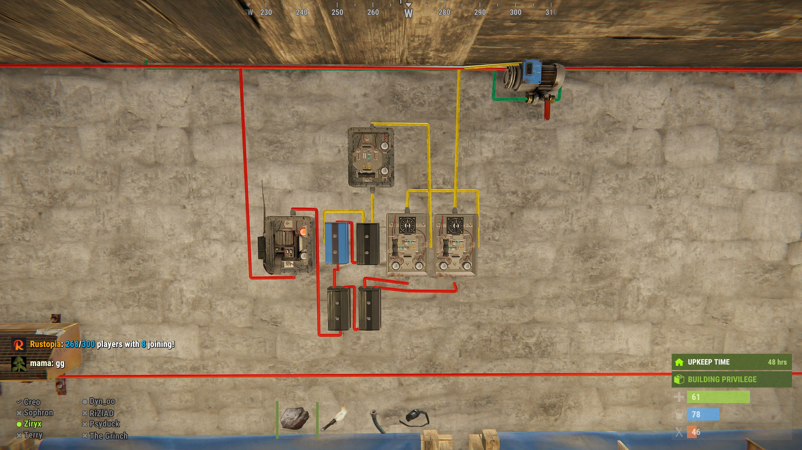

# Rust Farming Circuits & Watering
Included is a list of farming circuits and watering diagrams that you can design and build on Rust.  I've included links to the circuit design on rustician.io as well as the xml exports of the circuits you can use here.

### Ultimate Farming Grow Lab
This is a base I've personally setup on a live PVP server.  It's designed to grow 24 planter boxes but could be used to water upto 36 planter boxes. 
The limitation is the water output from the water barrels. 
You could modify this to add more by using a combiner and more pumps if desired. 
This design was able to let me move water from 2 large grids away on Rust by placing the pump and branch in a triangle TC with a metal door. 
It is exposed to someone taking the pipeline down, but they wouldn't get much by blowing doors off a triangle TC. 
I use a push and pull system as well... 
I use the power from the water pump station to supply electricity to half of the pipeline, and I supply electricity the other way by using a pull system. 
If you are flowing downhill, you don't need to supply power to the fluid switch and pump, but if you go up and down hills, you may still want to run power for when you go up a hill.  To save on power, 
you can use a blocker to continue to extend the power to the next TC as it only costs 1 rW as opposed to the 3rW that each branch requires. 
  
The Automated Timers are also setup so the left timer sets the cycle time, and the right timer sets how many seconds during that cycle the water is running. 
You need to do some math based on the sprinkler flow rate of 144ml/m to the requirements of your plants to figure out your ratios, but I've found 40seconds on the left timer and 25seconds on the right timer 
is a good balance and works for almost everything.  The switch on the top of the timer circuits are simply to allow me to change the time on the timers.  You can't set the time unless power is supplied. 

<b>Links:</b>
* [Rustician.io Circuit Link](https://www.rustrician.io/?circuit=6dc0eb52efca6e5d42d94dd6517b3346)
* [XML Export](xml/UltimateFarmingGrowLab.xml)