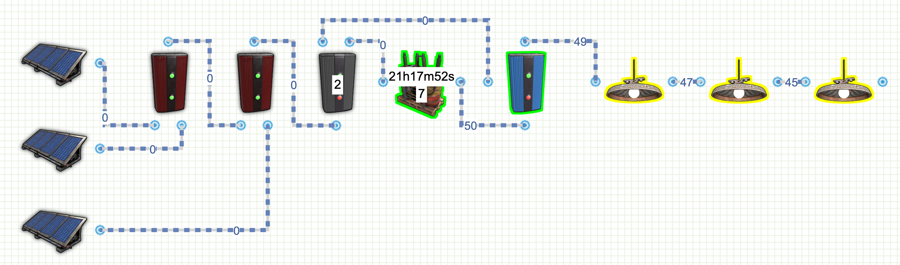
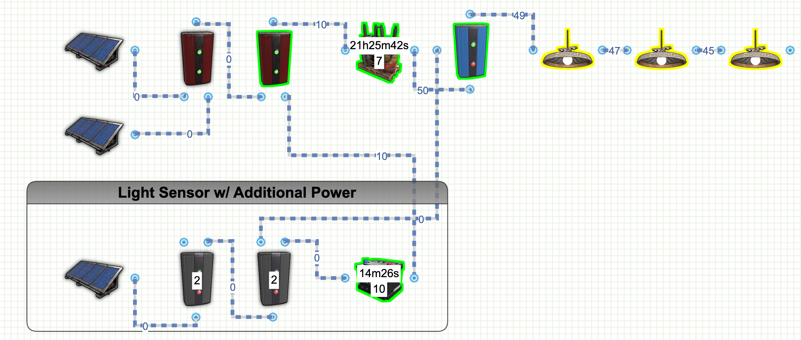
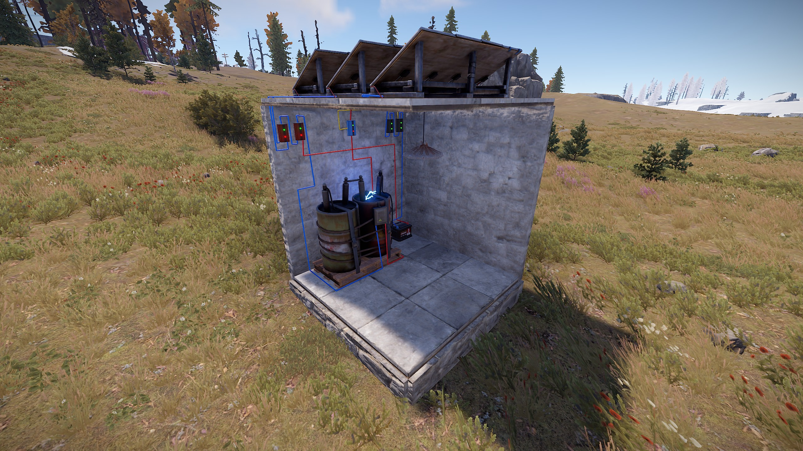
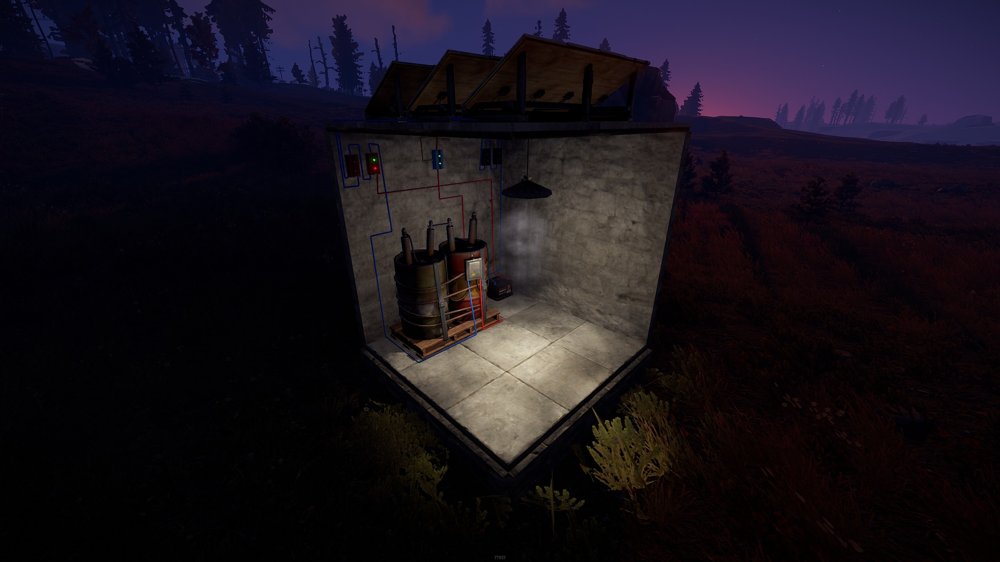

# Rust Lighting Circuits
Included is a list of lighting circuits that you can design and build on Rust.  I've included links to the circuit design on rustician.io as well as the xml exports of the circuits you can use here.

## Basic Automatic Lights Circuit

This is a basic automatic lighting setup, it uses 3 rW as a signal to indicate there is no electricity being generated from any of the solar panels 
<b>Links:</b>
* [Rustician.io Circuit Link](https://www.rustrician.io/?circuit=00fafc228978eebd0616996a7904b386)
* [XML Export](xml/BasicAutoLights.xml)

## Advanced Automatic Lights Circuit

This advanced automatic lighting lets you control roughly how dark you want the lights to come on by setting a required minimum amount of draw (4 rW). 
This will mean when the power supplied to the signal panel drops below 20% light, the lights turn on.  You can adjust this setting to have the lights come on earlier or later.  
Additionally there's no need to waste electricity, the extra rW can be fed into a small battery and back into the root combiner. 
If you need the lights to come on later, You'll need to switch to only one Electrical Branch.  Using the two allows you to provide maximum amount of power to the spare battery. 
<b>Links:</b>
* [Rustician.io Circuit Link](https://www.rustrician.io/?circuit=5cb2fdf4600dbf3edd42de5d13f5fa75)
* [XML Export](xml/AdvancedAutoLights.xml)