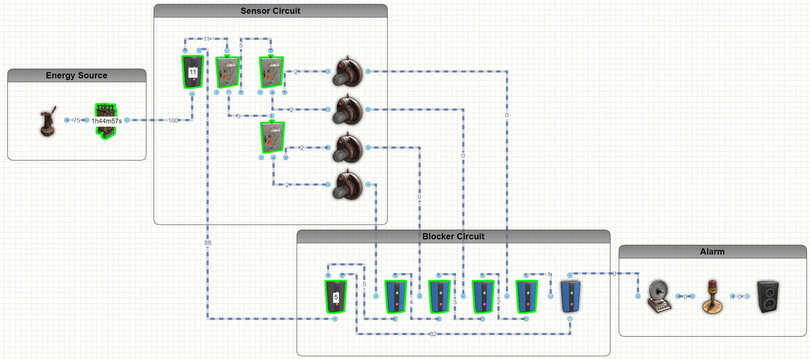

# Rust Smart Alarm Circuits
Included is a list of smart alarm circuits that you can design and build on Rust.  I've included links to the circuit design on rustician.io as well as the xml exports of the circuits you can use here.

## Battery Blocker Smart Alarm

I've seen several smart alarms out there that use lots of AND and OR switches to detect enemies around a base, and I've even used them myself in the past, 
but this alarm is the most energy efficient setup to detect and alert on motion around the your base. 
This setup would be good for detecting in 4 directions of your base and powering a Smart Alarm, Siren, and Speaker. 
The active rW for this is only 17rW, and active is 20 rW.  Most similar setups using AND and OR switches would be over 30 rW of active use. 
<b>Links:</b>
* [Rustician.io Circuit Link](https://www.rustrician.io/?circuit=6811a3ab852c455a5aaa7e3d732056e0)
* [XML Export](xml/BatteryBlockerSmartAlarm.xml)