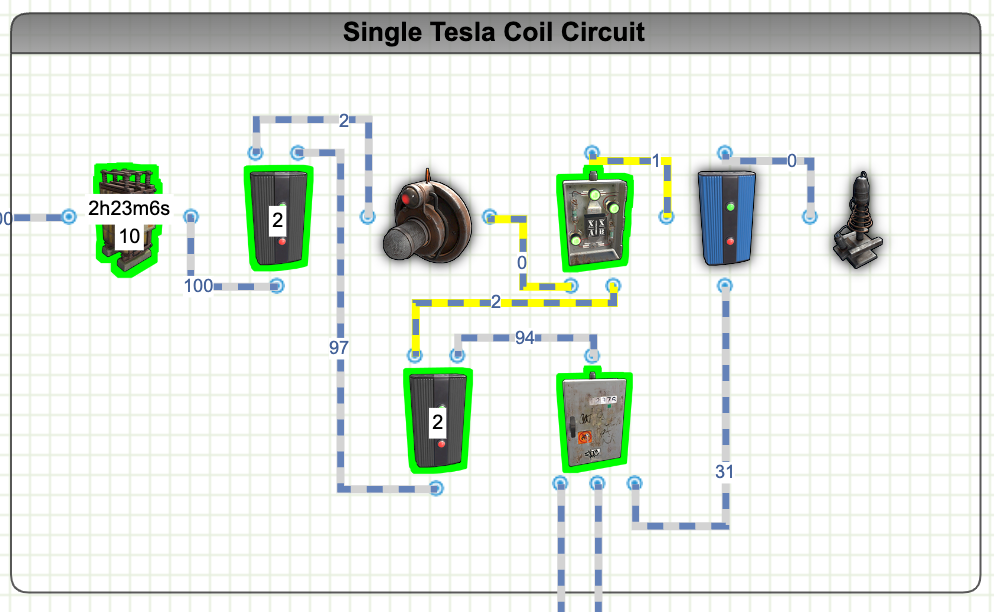

# Rust Tesla Coil Circuits
Included is a list of tesla coil circuits that you can design and build on Rust.  I've included links to the circuit design on rustician.io as well as the xml exports of the circuits you can use here.

## Basic Automatic Lights Circuit

This circuit is a single battery tesla coil design that only uses a single battery but only drains 7 rW of electricity from the battery until the sensor is activated. 
This design allows for 31 rW of power to the coil out of the possible 35 rW max. 
It's possible to use a branch instead of a splitter to set 35 rW, but that will increase the Active drain from 7 rW to 42 rW even if the coil isn't in use. 
A final option would be to make the tesla coil the last energy use on the end of the circuit to get more output. 
<b>Links:</b>
* [Rustician.io Circuit Link](https://www.rustrician.io/?circuit=111c169b672a8cd03b8c067c9224791e)
* [XML Export](xml/TeslaCoil-HBHFSensorActivated-SingleBattery.xml)