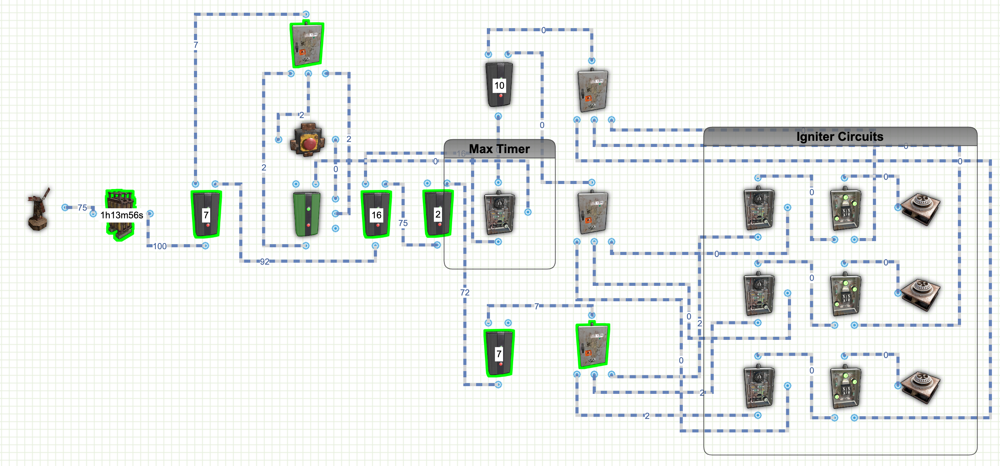

# Rust Timer Circuits
Included is a list of timer circuits that you can design and build on Rust.  I've included links to the circuit design on rustician.io as well as the xml exports of the circuits you can use here.

## Fireworks Display - Staggered Timers

The following Circuit uses the igniters on a staggering setup to ignite fireworks on 5, 20, and 45 seconds after hitting the button. 
This circuit could be used for anything you need to happen after a certain amount of time once you hit a button. 
The Max timer must be set longer than the igniter timers 
<b>Links:</b>
* [Rustician.io Circuit Link](https://www.rustrician.io/?circuit=44cda47c2666384e6310b578fd08d657)
* [XML Export](xml/FireworksDisplay.xml)