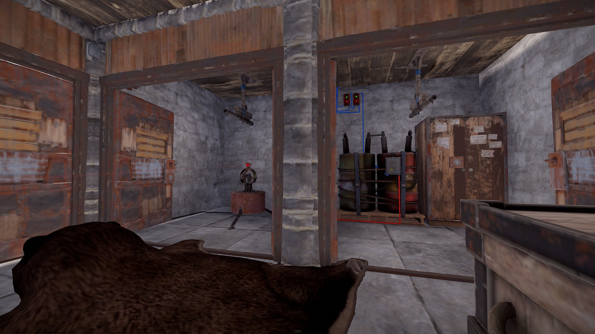
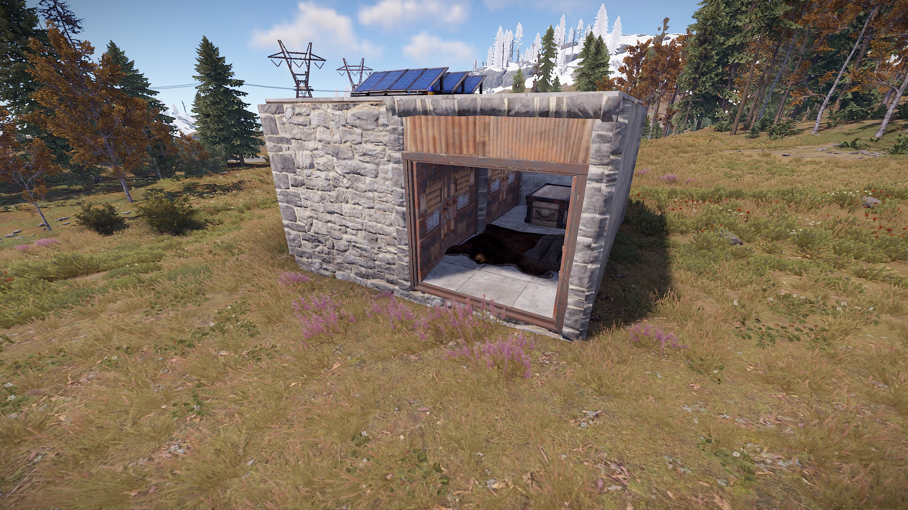
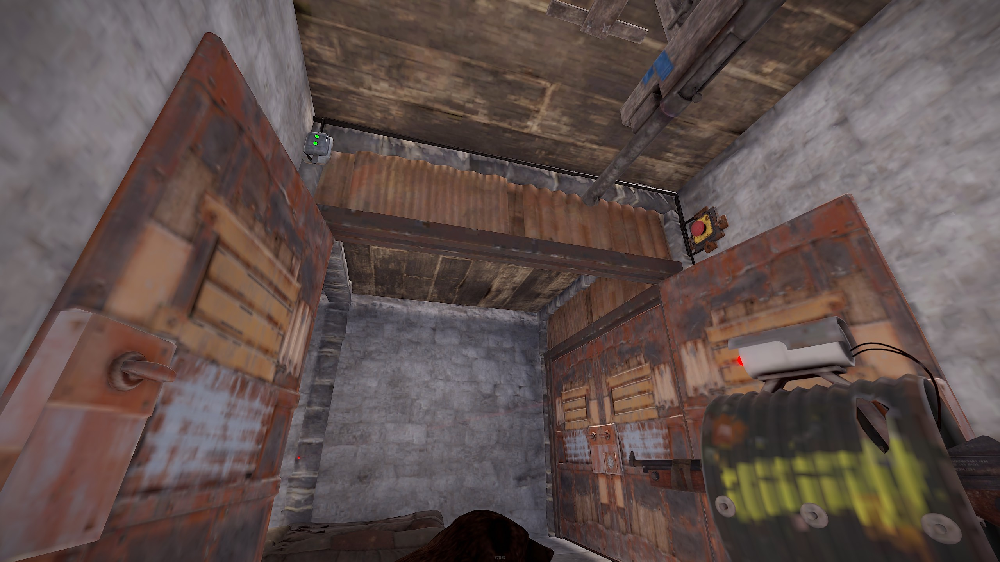

# Rust Tesla Coil Circuits
Included is a list of trap base circuits that you can design and build on Rust.  I've included links to the circuit design on rustician.io as well as the xml exports of the circuits you can use here.

## 2x2 Trap Base

This Circuit is designed for a 2x2 square base.  I've successfully tested this circuit on a vanilla PVP server and it works great. 
Cover the pressure plate with a rug and/or your sleeping bag.  When tripped, the front door closes behind, and two side doors are opened where shotgun traps are found. 
Additionally the turret activates and starts firing. Requires 12 rW when idle, and 22 rW once set. 
When I built this, I created this as a base a short ways off of my main base, and ran route combiners hidden on the ground, so you can't tell the base has electricity. 
I hid all the circuitry aswell and added a blue light in a not so obvious area so I could see from my main base if the trap had been triggered. 
<b>Links:</b>
* [Rustician.io Circuit Link](https://www.rustrician.io/?circuit=c2a69ac375fe8c81ce79ea204078c269)
* [XML Export](xml/2x2TrapBase.xmll)